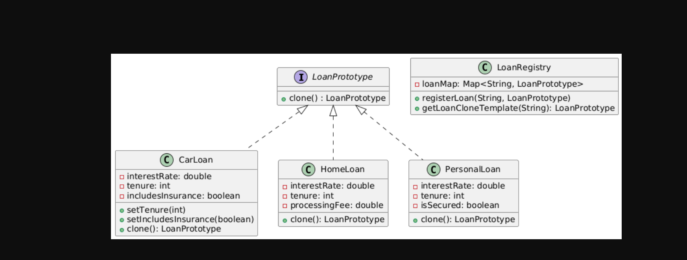

# 🧬 Prototype Design Pattern – Banking System (Java)

## 📖 What is Prototype Pattern?
The Prototype Design Pattern allows you to clone existing objects instead of creating new ones using `new`. It's useful when object creation is costly or you want to avoid repetitive setup logic.

---

## 🏦 Use Case: Banking Loans

Loan types:
- HomeLoan
- CarLoan
- PersonalLoan

Each loan implements a common interface `LoanPrototype` with a `clone()` method. Prototypes are registered in a `LoanRegistry`.

---

## 🗂️ Components

### 🔹 `LoanPrototype` Interface

```java
public interface LoanPrototype extends Cloneable {
    LoanPrototype clone();
}

## UML Digram
@startuml
interface LoanPrototype {
  +clone() : LoanPrototype
}

LoanPrototype <|.. CarLoan
LoanPrototype <|.. HomeLoan
LoanPrototype <|.. PersonalLoan

class CarLoan {
  - interestRate: double
  - tenure: int
  - includesInsurance: boolean
  +setTenure(int)
  +setIncludesInsurance(boolean)
  +clone(): LoanPrototype
}

class HomeLoan {
  - interestRate: double
  - tenure: int
  - processingFee: double
  +clone(): LoanPrototype
}

class PersonalLoan {
  - interestRate: double
  - tenure: int
  - isSecured: boolean
  +clone(): LoanPrototype
}

class LoanRegistry {
  - loanMap: Map<String, LoanPrototype>
  +registerLoan(String, LoanPrototype)
  +getLoanCloneTemplate(String): LoanPrototype
}
@enduml

